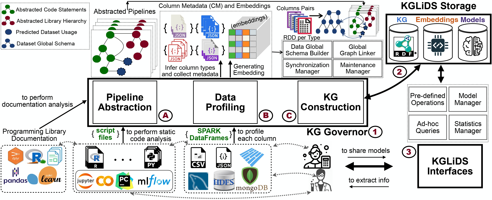

# KGLiDS - Linked Data Science Powered by Knowledge Graphs




In recent years, we have witnessed the growing interest from academia and industry in applying data science technologies to analyze large amounts of data. While in this process a myriad of artifcats (datasets, pipeline scripts, etc.) are created, there has so far been no systematic attempt to holistically collect and exploit all the knowledge and experiences that are implicitly contained in those artifacts. Instead, data scientists resort to recovering information and experience from colleagues or learn via trial and error. 
Hence, this paper presents a scalable system, KGLiDS, that employs machine learning and knowledge graph technologies to abstract and capture the semantics of data science artifacts and their connections. Based on this information KGLiDS enables a variety of downstream applications, such as data discovery and pipelines automation. 
Our comprehensive evaluation covers use cases in data discovery, data cleaning, transformation, and AutoML and shows that KGLiDS is significantly faster with a lower memory footprint as the state of the art while achieving comparable or better accuracy.

## Quickstart on Colab
Try out our [KGLiDS Colab Demo](https://colab.research.google.com/drive/1dDiGh1KwJibR2pVjiMXFpHIHxfgByYxZ?usp=sharing) and [KGLiDS DataPrep Demo](https://colab.research.google.com/drive/1_gjONJlQwumhSOP5k_9b0O6xdTR5Gqbq?usp=sharing) that demonstrates our APIs on Kaggle data!

[comment]: <> (## Technical Report)
[comment]: <> (Our technical report is available on [ArXiv]&#40;https://arxiv.org/abs/2303.02204&#41; and includes more details on our system and interfaces is available)

## Linked Data Science: Systems and Applications
To learn more about Linked Data Science and its applications, please watch Dr. Mansour's talk at Waterloo DSG Seminar ([Here](https://www.youtube.com/watch?v=99wvN04C5fU)). 

## Requirements
* Conda
* Java (make sure `$JAVA_HOME` env variable is set. [See Tutorial Here](https://www.digitalocean.com/community/tutorials/how-to-install-java-with-apt-on-ubuntu-22-04))
* Docker

## Installation
Run the project initialization script, which does the following:
* Creates `kglids` Conda environment.
* Downloads necessary pip packages.
* Downloads necessary word embedding models.
* Downloads and runs GraphDB docker container.
* Install Postgresql and pgvector (sets default password to `postgres`).

```commandline
bash init.sh
```

## Setting Up The Data

KGLiDS expects to set up the pipeline and csv files into the following directory structure:

```
<DATA SOURCE NAME>/
├── <DATASET 1 ID>/
│   ├── data/
│   │   ├── <TABLE NAME>.csv
│   │   ├── <TABLE NAME>.csv
│   │   └── ...
│   └── notebooks/
│       ├── <NOTEBOOK 1 ID>/
│       │   ├── <NOTEBOOK PYTHON FILE>.py
│       │   └── pipeline_info.json
│       ├── <NOTEBOOK 2 ID>
│       └── ...      
├── <DATASET 2 ID>
└── ...
```

The following is an example dataset under the `kaggle_small` data source:
```
kaggle_small
  └──antfarol.car-sale-advertisements
      ├── data
      │ └── car_ad.csv
      └── notebooks
          └── aidenchoi-notebooke85a1481e0
             ├── kernel-metadata.json
             ├── notebooke85a1481e0.py
             └── pipeline_info.json
```

Where `pipeline_info.json` files contain Kaggle pipeline details (see [setup_kaggle_data.py](storage_utils/setup_kaggle_data.py))

## Generating the KGLiDS graph:
* Add the data sources to [kglids_config.py](kglids_config.py).

* Run KGLiDS:

```commandline
python run_kglids.py
```

This script does the following:
* Profiles the datasets and creates the dataset graph.
* Analyzes pipeline scripts and creates pipeline graphs.
* Loads the constructed graphs into GraphDB.
* Loads the dataset embeddings into pgvector.


## Using the KGLiDS APIs</b>: 

KGLiDS provides predefined operations in form of python apis that allow seamless integration with a conventional data science pipeline.
Checkout the full list of [KGLiDS APIs](docs/KGLiDS_apis.md)

## LiDS Ontology
To store the created knowledge graph in a standardized and well-structured way,
we developed an ontology for linked data science: the <b>LiDS Ontology</b>.<br/>
Checkout [LiDS Ontology](docs/LiDS_ontology.md)!

## Benchmarks
The following benchmark datasets were used to evaluate KGLiDS:
* Data Discovery: Table Union Search
  * [D<sup>3</sup>L Small](https://github.com/alex-bogatu/d3l)
  * [TUS Small](https://github.com/RJMillerLab/table-union-search-benchmark)
  * [SANTOS Small](https://github.com/northeastern-datalab/santos/tree/main)
  * [SANTOS Large](https://github.com/northeastern-datalab/santos/tree/main) 

* [Data Cleaning, Data Transformation, and AutoML](gnn_applications/README.md)
* Kaggle
  * [`setup_kaggle_data.py`](storage/utils/setup_kaggle_data.py)

## KGLiDS APIs
See the full list of supported APIs [here](docs/KGLiDS_apis.md).

## Citing Our Work
If you find our work useful, please cite it in your research.
```
@INPROCEEDINGS{kglids,
  author={Helali, Mossad and Monjazeb, Niki and Vashisth, Shubham and Carrier, Philippe and Helal, Ahmed and Cavalcante, Antonio and Ammar, Khaled and Hose, Katja and Mansour, Essam},
  booktitle={2024 IEEE 40th International Conference on Data Engineering (ICDE)}, 
  title={KGLiDS: A Platform for Semantic Abstraction, Linking, and Automation of Data Science}, 
  year={2024},
  pages={179-192},
  url={https://doi.org/10.1109/ICDE60146.2024.00021},
  ISSN={2375-026X},
}
```


## Contributions
We encourage contributions and bug fixes, please don't hesitate to open a PR or create an issue if you face any bugs.

## Questions
For any questions please contact us:

mossad.helali@mail.concordia.ca

essam.mansour@concordia.ca
